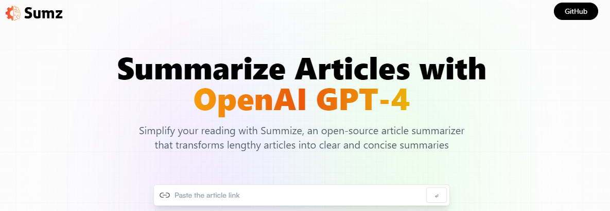

<div align='center'>

</div>

<p align="center">
  

  
  
  <a href="https://github.com/ArthurB95/CarShowCase/commits/master">
    
  </a>
    
</p>

<h4 align="center"> 
	🚧  Summarize Articles  ♻️ Finished 🚀 🚧
</h4>

## 💻 About the project

- 🚀 This project is already live and you can access it directly through this link: https://car-show-case-tj6q.vercel.app/
- 👨‍💻 Summarize Articles  - The intention of this project is for artificial intelligence to read articles and summarize them using only their URL

---

## ⚙️ Functionalities

-   [x] Have history of searched links;
-   [x] Input to insert link and artificial intelligence reads it.

---

## 🚀 How to run the project

```bash

# If you want to clone the repository just use the command:
$ git clone https://github.com/ArthurB95/Summarize_AI.git

# Perform node_modules installation:
$ npm install

# To run the project in the client folder:
$ npm run dev

```

---

## 🛠 Technologies

The technology used for this application was ReactJS, NodeJS, MongoDB, Cloudinary, OpenAI, TailwindCSS, below is the official documentation:

-   **[REACTJS](https://react.dev/)**
-   **[TAILWINDCSS](https://tailwindcss.com/)**
---

## 💪 Thanks

-   This project was made thanks to the channel **[JavaScript Mastery](https://www.youtube.com/@javascriptmastery/videos)**. Access the channel and support the created.
